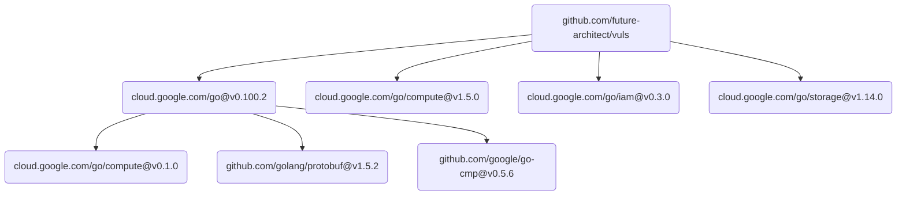

# GO MOD GRAPH

```mermaid
graph TD
    1("github.com/future-architect/vuls") --> 2("cloud.google.com/go@v0.100.2")
    1 --> 3("cloud.google.com/go/compute@v1.5.0")
    1 --> 4("cloud.google.com/go/iam@v0.3.0")
    1 --> 5("cloud.google.com/go/storage@v1.14.0")
    2 --> 6("cloud.google.com/go/compute@v0.1.0")
    2 --> 7("github.com/golang/protobuf@v1.5.2")
    2 --> 8("github.com/google/go-cmp@v0.5.6")
```